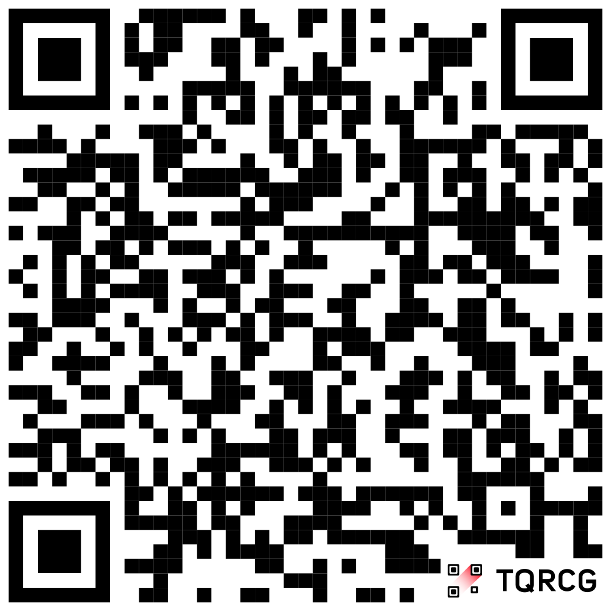

# 00 — Prerequisites

← [Index](README.md)  ·  [01 — Initialise the project](01-init-project.md) →

## Tools

| Tool | Install |
|------|---------|
| [uv](https://docs.astral.sh/uv/) | `curl -LsSf https://astral.sh/uv/install.sh \| sh` |
| Node.js 24+ | [nodejs.org](https://nodejs.org) |
| AWS CDK CLI | `npm install -g aws-cdk` — or prefix every command with `npx cdk` |
| AWS CLI v2 | [docs](https://docs.aws.amazon.com/cli/latest/userguide/getting-started-install.html) |

uv installs Python 3.12 for you. Check everything:

```
$ uv --version
$ npx cdk --version
```

## Slack

Join the workshop Slack before anything else — the AWS sign-in details are
shared there, not in this repository:

**[join.slack.com/t/pyconworld](https://join.slack.com/t/pyconworld/shared_invite/zt-47r9gilo5-qLLp_Xj0zJxN6OEDABchYg)**

## AWS

You need working credentials for AWS account. Your username and one-time
password arrive in Slack. Set up the profile below before you start 01.

### The SSO profile

The workshop account is reached through IAM Identity Center. Add both blocks
below to `~/.aws/config` — the profile names the account and role, the
`sso-session` names the portal they are requested from:

```ini
[profile pycon]
sso_session = pycon
sso_account_id = 790870651433
sso_role_name = iac-devops-participant
region = eu-central-1

[sso-session pycon]
sso_start_url = https://identitycenter.amazonaws.com/ssoins-6987380982a29c24
sso_region = eu-central-1
sso_registration_scopes = sso:account:access
```

Then log in — a browser opens for you to approve the request:

```
$ aws sso login --profile pycon
$ aws sts get-caller-identity --profile pycon
```

Export the profile once per shell so the AWS CLI and the CDK CLI both pick it
up, rather than passing `--profile` to every command:

```
$ export AWS_PROFILE=pycon
```

The session is short-lived. When a command starts failing with an expired-token
error, run `aws sso login` again.

The account has already been bootstrapped. Outside the workshop, do it
yourself once per account and region:

```
$ npx cdk bootstrap aws://<account-id>/<region>
```

### The parent hosted zone

Step 03 delegates a subdomain of `pycon.foo`, which lives in another account.
That account holds a role named `CrossAccountZoneDelegationRole` your account
may assume in order to write the NS record.

### The GitHub connection

The pipelines you write in step 04 pull source through an AWS **CodeConnections** connection.
Creating one needs a browser handshake, so it is done once, out of band, and its
ARN stored in SSM:

```
$ aws codeconnections create-connection \
      --provider-type GitHub --connection-name github-czarny
# then authorise it in the console: Developer Tools → Settings → Connections

$ aws ssm put-parameter --name /codestar-connection/github-czarny --type String \
      --value arn:aws:codeconnections:<region>:<account>:connection/<uuid>
```

The parameter name is `CONNECTION_ARN_PARAMETER` in
[pycon2026/cdk_pipeline.py](https://github.com/czarny/pycon2026/blob/main/pycon2026/cdk_pipeline.py). 

---

← [Index](README.md)  ·  [01 — Initialise the project](01-init-project.md) →
