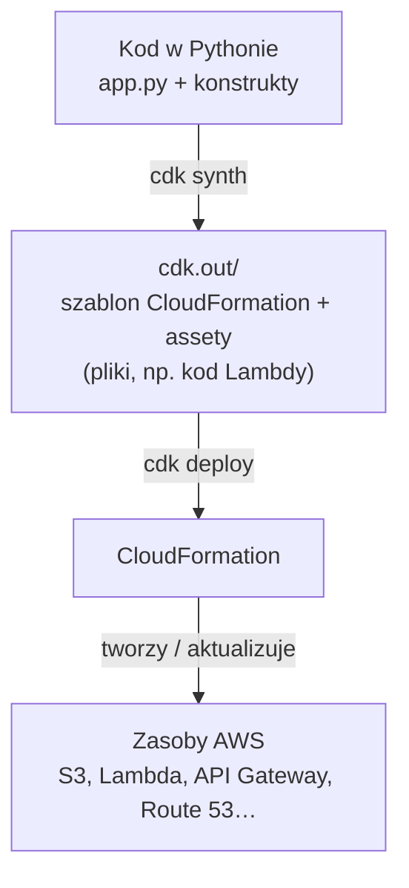
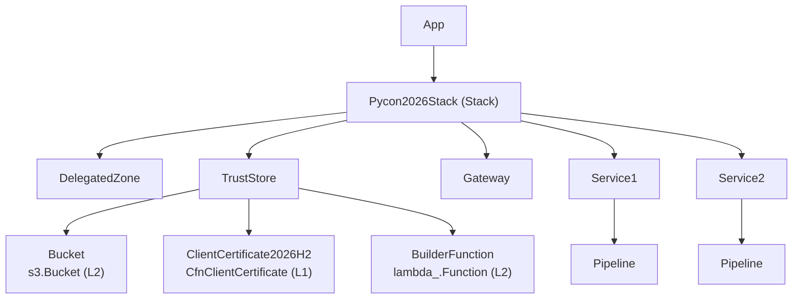
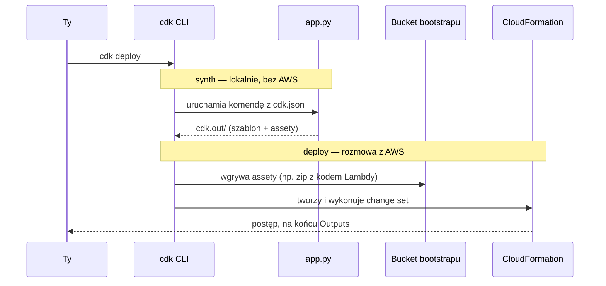
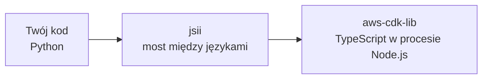

# Wprowadzenie do AWS CDK

## 1. Po co w ogóle CDK?

Infrastruktura w AWS to dziesiątki zasobów, które muszą do siebie pasować: bucket S3, funkcja Lambda, rola IAM pozwalająca tej funkcji pisać do bucketu, log group, API Gateway, rekord DNS… Wyklikanie tego w konsoli działa raz. Za drugim razem (drugie środowisko, drugi region, kolega z zespołu) już nie.

Odpowiedzią AWS jest **CloudFormation**: opisujesz zasoby deklaratywnie w szablonie JSON/YAML, a usługa sama je tworzy, aktualizuje i usuwa, pilnując kolejności i wycofując nieudane zmiany. Problem w tym, że szablony są rozwlekłe (Lambda z rolą i logami to ~100 linii YAML-a), nie mają pętli, funkcji ani typów, a ich ponowne wykorzystanie kończy się na copy-paste.

**AWS CDK (Cloud Development Kit)** to biblioteka, w której tę samą infrastrukturę opisujesz w normalnym języku programowania: Pythonie, TypeScripcie, Javie, C#, Go. Kod CDK nie tworzy zasobów bezpośrednio — **generuje szablon CloudFormation**, a wdrożenie nadal wykonuje CloudFormation. CDK to w gruncie rzeczy kompilator: Python → CloudFormation.

Co zyskujesz:

- **Sensowne domyślne wartości.** `s3.Bucket(self, "Bucket")` to jedna linia z zablokowanym publicznym dostępem; `lambda_.Function(...)` sama tworzy sobie rolę wykonawczą.
- **Relacje między zasobami jako kod.** `bucket.grant_write(function)` generuje politykę IAM z właściwymi akcjami i ARN-ami — nie musisz ich znać na pamięć.
- **Abstrakcje.** Powtarzalny fragment infrastruktury zamykasz w klasie i używasz jej wiele razy.
- **Narzędzia języka.** Pętle, warunki, typy, testy, IDE z podpowiadaniem, `black`, `pytest`.

## 2. Model: App → Stack → Construct

Wszystko w CDK jest **konstruktem** (`Construct`) i wszystko układa się w drzewo:

- **App** — korzeń drzewa; jedna aplikacja CDK (`../../app.py`).
- **Stack** — jednostka wdrożenia. Jeden stack = jeden szablon = jeden stack CloudFormation. Zasoby w stacku są tworzone, aktualizowane i usuwane razem.
- **Construct** — dowolny klocek: od pojedynczego zasobu (bucket) po cały podsystem (pipeline z rolami, logami i projektem CodeBuild).

Każdy konstrukt dostaje w konstruktorze `scope` (rodzica) i `id` (nazwę unikalną wśród rodzeństwa). Dlatego każde wywołanie w CDK zaczyna się od `(self, "CośTam", ...)`.

Tak wygląda przykładowy fragment drzewa konstruktów CDK. Z pozycji konstruktu w drzewie (np. `Pycon2026Stack/TrustStore/Bucket`) CDK wyprowadza **logical ID** zasobu w CloudFormation: sklejone elementy ścieżki bez nazwy stacka, plus hash — `TrustStoreBucket1FDD8F29`.

> Zmiana `id` konstruktu zmienia logical ID, a CloudFormation widzi wtedy usunięcie starego zasobu i utworzenie nowego.

### Trzy poziomy konstruktów

Konstrukty dzielą się na trzy poziomy abstrakcji:

| Poziom | Co to | Przykład |
|---|---|---|
| **L1** (`Cfn*`) | Odwzorowanie 1:1 zasobu CloudFormation, generowane automatycznie ze specyfikacji. Wszystkie właściwości, zero pomocy. | `apigateway.CfnClientCertificate` |
| **L2** | Ręcznie zaprojektowana klasa: domyślne wartości, metody `grant_*`, `add_*`, `metric_*`, typy zamiast stringów. Tu spędza się większość czasu. | `s3.Bucket`, `lambda_.Function`, `apigateway.RestApi` |
| **L3** (patterns) | Gotowe rozwiązania złożone z kilku zasobów. | `apigateway.LambdaRestApi`, `ecs_patterns.ApplicationLoadBalancedFargateService` |

Gdy L2 czegoś nie umie, schodzisz niżej: `bucket.node.default_child` zwraca L1 (`CfnBucket`), na którym ustawisz każdą właściwość CloudFormation.

**Własne konstrukty** to po prostu klasa, która w `__init__` tworzy inne konstrukty. Zwykle dziedziczy po `Construct`, czasem po gotowym L2, żeby go rozszerzyć. To główny mechanizm wielokrotnego użycia kodu w CDK.

## 3. Cykl pracy

Dwa światy: **synth** dzieje się lokalnie i nie wymaga AWS (poza lookupami, czyli odpytywaniem konta o istniejące zasoby); **deploy** to już rozmowa CLI z CloudFormation.

| Komenda | Co robi |
|---|---|
| `cdk bootstrap` | Raz na konto i region: stawia stack `CDKToolkit` z bucketem na assety i rolami IAM (`cdk-*`), z których korzysta `cdk deploy`. Bez tego deploy się nie uda. |
| `cdk synth` | Uruchamia aplikację i zapisuje szablony do `../../cdk.out`. Warto tam zajrzeć, żeby zobaczyć, co CDK faktycznie wygenerowało. |
| `cdk diff` | Porównuje wygenerowany szablon z tym, co jest wdrożone. Przed każdym deployem. |
| `cdk deploy` | Wgrywa assety i wykonuje zmiany w CloudFormation. Zmiany rozszerzające dostęp (nowe uprawnienia IAM, otwarte reguły security group) wymagają potwierdzenia. |
| `cdk destroy` | Usuwa stack. |

`cdk deploy`, `cdk diff` i lookupy korzystają z tych samych poświadczeń co `aws` CLI (`AWS_PROFILE` lub `aws configure`); z nich CDK bierze też domyślne konto i region.

## 4. Python to nakładka na TypeScript

`aws-cdk-lib` jest napisany w TypeScripcie. Wersja pythonowa (podobnie jak każda inna poza TypeScriptem) to automatycznie wygenerowana warstwa **jsii**, która uruchamia w tle proces Node.js i przekazuje do niego wywołania.

Konsekwencje:

- Node.js jest wymagany, nawet jeśli nie napiszesz ani linii JS-a.
- Import `aws_cdk` i start procesu Node zajmują kilka sekund.
- Dokumentacja i większość przykładów w internecie są w TypeScripcie. Tłumaczenie jest mechaniczne.
- Błędy walidacji przychodzą z warstwy TS i czasem tak brzmią (`RuntimeError: ... jsii ...`).
