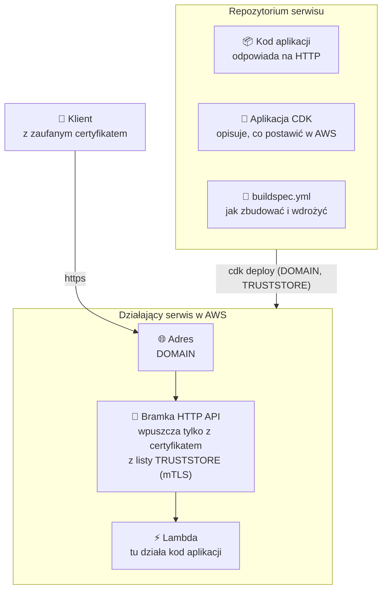

# Serwis

## 1. Czym jest serwis

W tym warsztacie **serwis** to jedno repozytorium, które umie samo trafić na AWS. Ma w środku trzy rzeczy: kod aplikacji, własną aplikację CDK (przepis na infrastrukturę tylko dla siebie) i `buildspec.yml` (jak to zbudować i wdrożyć).

Kontrakt jest krótki:

- **Dostaje** przy wdrożeniu: `DOMAIN` — swój adres; `TRUSTSTORE` — gdzie leży lista certyfikatów, którym ma ufać.
- **Musi**: postawić pod `DOMAIN` HTTP API, które wpuszcza tylko żądania z certyfikatem z trust store'u (mTLS), i mieć `buildspec.yml` w katalogu głównym.
- **Nie musi**: wiedzieć nic o pipeline'ach, strefie DNS ani o tym, kto go wywołuje.

## 2. Struktura

## 3. Dwa wcielenia

Mamy dwa serwisy, celowo w dwóch językach. Z zewnątrz są nieodróżnialne: oba odpowiadają JSON-em na `/`.

| | `fast_app` | `hono_app` |
|---|---|---|
| Aplikacja | Python 3.14 + FastAPI | TypeScript (Node.js 24) + Hono |
| Aplikacja CDK | Python, `cdk/app.py` | TypeScript, `cdk/app.ts` |
| Pakowanie Lambdy | `uv` | `esbuild` |
| Parametry wdrożenia | `DOMAIN`, `TRUSTSTORE` | `DOMAIN`, `TRUSTSTORE`, `LABEL` |
