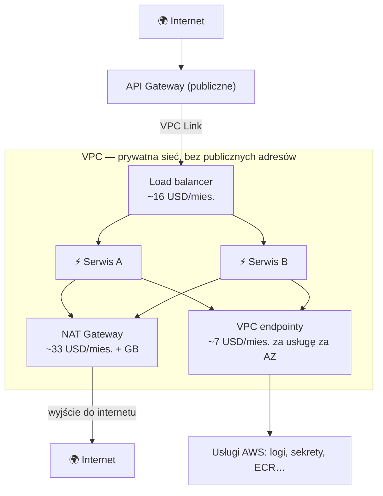
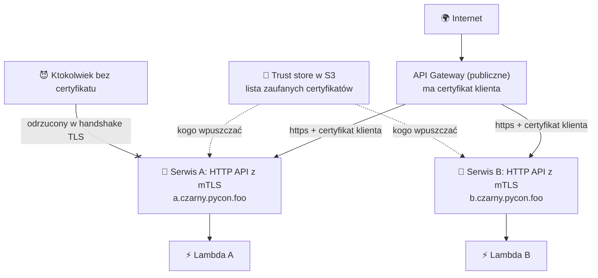
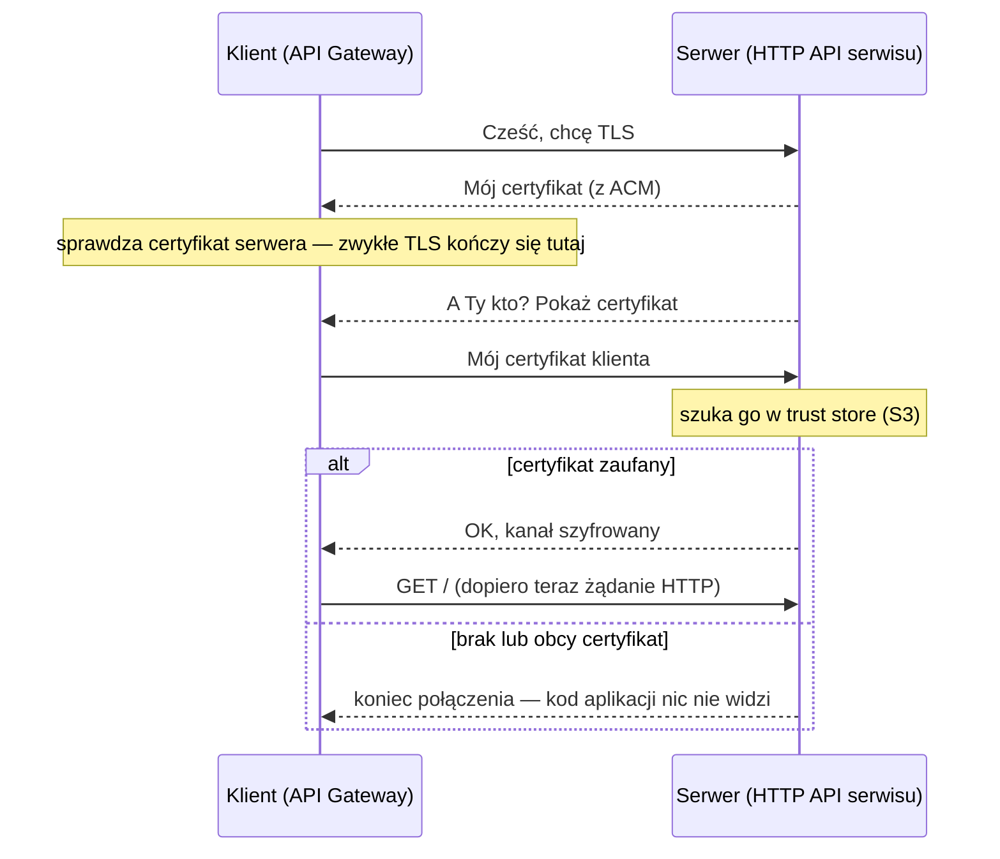

# Mikroserwisy: VPC czy mTLS?

## 1. Problem

Mikroserwis nie powinien być dostępny dla całego internetu — ma odpowiadać tylko naszej bramie i ewentualnie innym naszym serwisom. Są dwie szkoły: **schować** go w prywatnej sieci, do której obcy nie ma jak dojść, albo **zostawić na widoku**, ale odrzucać każdego, kto nie udowodni, kim jest. AWS w dokumentacji i architekturach referencyjnych promuje pierwszą. My idziemy drugą.

## 2. Sposób „błogosławiony przez AWS”: VPC

VPC to Twoja prywatna sieć w AWS: podsieci, routing, security groups. Serwisy lądują w podsieciach prywatnych, bez publicznych adresów. Żeby cokolwiek do nich dotarło — i żeby one mogły dosięgnąć czegokolwiek — potrzeba dodatkowych elementów, a każdy z nich ma licznik godzinowy, który bije także wtedy, gdy nikt nic nie woła.

| Element | Po co | Koszt stały (orientacyjnie, us-east-1) |
|---|---|---|
| NAT Gateway | serwisy w prywatnej podsieci mogą wyjść do internetu (zewnętrzne API, pakiety) | ~33 USD/mies. za sztukę + 0,045 USD/GB; produkcyjnie po jednym na AZ |
| Load balancer (ALB/NLB) | jeden punkt wejścia do serwisów; VPC Link z API Gateway zwykle wskazuje na niego | ~16 USD/mies. + ruch |
| VPC endpoint (interface) | dostęp do usług AWS bez wychodzenia do internetu | ~7 USD/mies. za usługę za AZ |
| VPC Lattice | nowsza alternatywa: sieć serwisów bez load balancerów | ~18 USD/mies. za serwis + ruch |

Skromna, nieprodukcyjna instalacja (1 NAT, 1 load balancer, 4 endpointy w 2 AZ) to ok. 100 USD miesięcznie **przy zerowym ruchu**. Wersja HA w trzech AZ — kilkaset. Dla dwóch hello-worldów na warsztat to koszt samej otoczki, nie serwisów.

Co się za to dostaje: serwisy nie mają publicznego adresu, ruch nie opuszcza sieci AWS, izolację opisuje się security groupami, a audytor odhacza „private networking”.

## 3. Nasz sposób: mTLS bez VPC

Serwis stoi w internecie, pod własną domeną, ale jego HTTP API ma włączone **mTLS**: przyjmuje tylko połączenia od klienta, który pokaże certyfikat z naszej listy zaufanych (trust store). Jedyny taki klient to nasze API Gateway. Reszta świata nie dostaje nawet odpowiedzi HTTP — połączenie kończy się na handshake'u TLS, zanim żądanie dotrze do kodu.

| Element | Koszt |
|---|---|
| API Gateway (REST) | 3,50 USD za milion żądań |
| HTTP API serwisu | 1,00 USD za milion żądań |
| Lambda | za wywołanie i milisekundy; 1 mln wywołań/mies. za darmo |
| Certyfikaty (ACM, certyfikat klienta API Gateway), mTLS, trust store w S3 | 0 |
| Strefa Route 53 | 0,50 USD/mies. |

Koszt stały: 50 centów miesięcznie. Reszta rośnie z ruchem — a bez ruchu wynosi zero.

Czego się tu **nie** dostaje:

- **Izolacji sieciowej.** Adres serwisu jest publiczny: każdy może zapukać, choć obcy nie wejdzie. Przed zalewem połączeń broni API Gateway i jego limity, nie firewall.
- **Ruchu wewnątrz AWS.** Wywołania idą przez publiczny internet — szyfrowane, ale poza VPC.
- **Spokoju z certyfikatami.** Certyfikat klienta wygasa po roku; trzeba go rotować, odświeżyć trust store i wdrożyć serwisy na nowo.
- **Zgodności na papierze.** Niektóre regulacje wymagają prywatnej sieci niezależnie od kryptografii.

> [!IMPORTANT]
> Serwis musi mieć wyłączony domyślny adres `execute-api`. Na nim mTLS nie działa, więc byłby tylnym wejściem obok pilnowanej domeny.

## 4. mTLS w pigułce

Zwykłe TLS (to „s” w https) uwierzytelnia tylko jedną stronę: serwer pokazuje certyfikat, klient go sprawdza i odtąd rozmowa jest szyfrowana. Klient pozostaje anonimowy — kim jest, dowiadujemy się dopiero z nagłówków HTTP (token, klucz API), czyli już w kodzie aplikacji.

W **mTLS** (mutual TLS) serwer w trakcie tego samego handshake'u prosi klienta o *jego* certyfikat i sprawdza go w swojej liście zaufanych — trust store. Obcy odpada, zanim padnie pierwsze żądanie HTTP.

| Element | U nas |
|---|---|
| Certyfikat serwera | z ACM, dla domeny serwisu, za darmo, odnawiany automatycznie |
| Certyfikat klienta | generowany przez API Gateway; dołączany do każdego wywołania serwisu |
| Trust store | plik PEM w S3 z tym certyfikatem; serwis dostaje jego adres jako `TRUSTSTORE` |
| Rotacja | nowy certyfikat klienta → nowy plik w S3 → ponowne wdrożenie serwisów |
